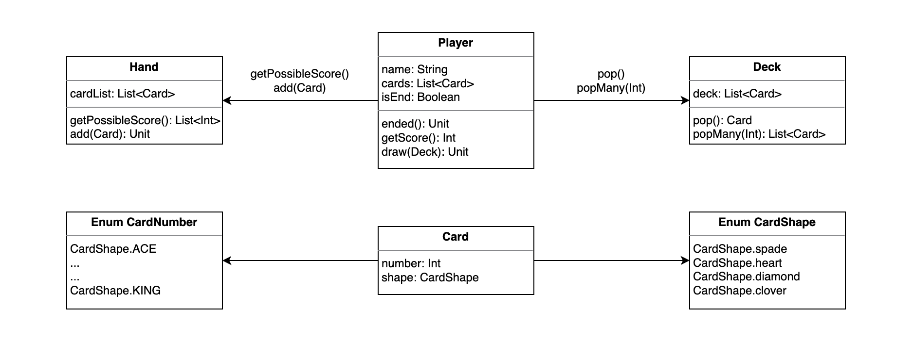

# kotlin-blackjack

## step2
- 초기 설계

    

- [x] Player는 이름을 가진다.
- [x] Deck에서 카드를 원하는 개수만큼 뽑는다.
- [x] Deck보다 많은 수의 카드를 뽑으려고 하면 에러가 발생한다.
- [ ] A 카드는 1점 혹은 11점으로 계산되고, JQK는 10점으로 계산된다. 그 외는 자신의 숫자대로 계산된다.
- [x] Player는 Deck에서 카드를 뽑는다.
- [x] Player는 점수가 21점을 초과하면 카드를 뽑을 수 없다.
- [ ] Player 중에서 가장 점수가 21점에 가까운 Player가 승리한다
