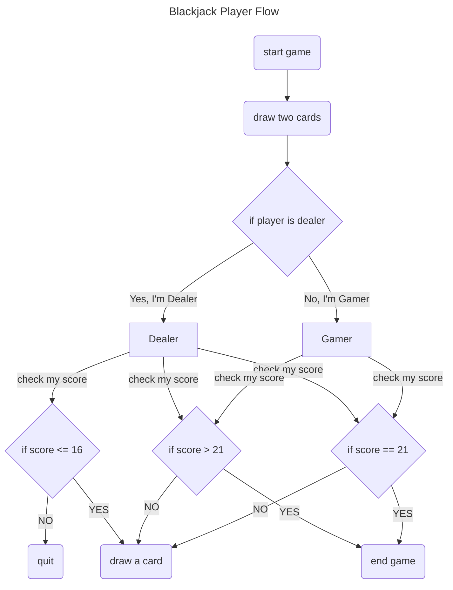

```mermaid
---
title: Blackjack Player Flow
---
flowchart TD
    gamer[Gamer]
    dealer[Dealer]

    startGame(start game)
    endGame(end game)
    drawTwoCards(draw two cards)
    draw(draw a card)
    quit(quit)
    
    checkPlayer{if player is dealer}
    checkScoreUnder16{ if score <= 16}
    checkOver21{ if score > 21}
    checkBlackjack{ if score == 21}
    
    startGame --> drawTwoCards --> checkPlayer
    checkPlayer --> |Yes, I'm Dealer| dealer
    checkPlayer --> |No, I'm Gamer| gamer
    

    dealer --> |check my score| checkScoreUnder16
    dealer --> |check my score| checkOver21
    dealer --> |check my score| checkBlackjack
    
    gamer --> |check my score| checkOver21
    gamer --> |check my score| checkBlackjack

    checkScoreUnder16 --> |NO| quit
    checkScoreUnder16 --> |YES| draw
    
    checkOver21 --> |YES| endGame
    checkOver21 --> |NO| draw
    
    checkBlackjack --> |YES| endGame
    checkBlackjack --> |NO| draw

    

```
