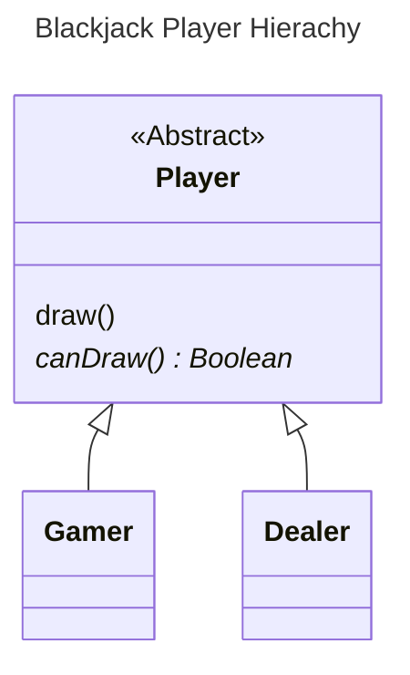

```mermaid
---
title: Blackjack Player Hierachy
---
classDiagram
    class Player {
        draw()
        canDraw()* Boolean
    }
    <<Abstract>> Player

    Player <|-- Gamer
    Player <|-- Dealer
    
```
