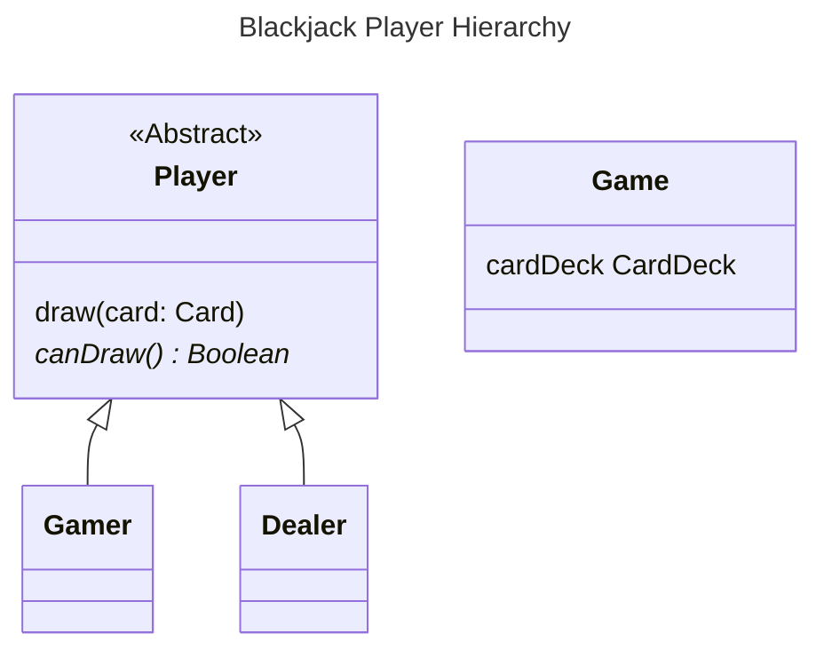

```mermaid
---
title: Blackjack Player Hierarchy
---
classDiagram
    class Player {
        draw(card: Card)
        canDraw()* Boolean
    }
    <<Abstract>> Player

    Player <|-- Gamer
    Player <|-- Dealer
    
    class Game {
        cardDeck CardDeck
    }

```
